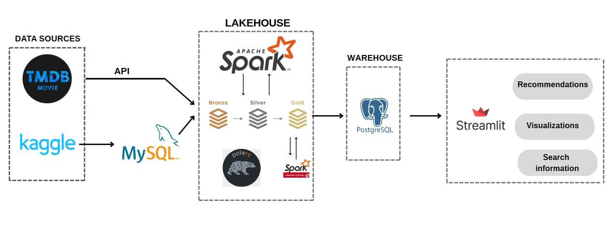

# ELT Pipeline for TMDB-Pipeline-Recommendation

TMDB-Pipeline-Recommendation là một dự án thuộc lĩnh vực Data Engineering, nhằm xây dựng một hệ thống ELT pipeline xử lý dữ liệu hỗ trợ cho:

     Hệ thống gợi ý phim dựa trên lịch sử đánh giá phim của cá nhân(Recommendation System)
     Dashboard phân tích và báo cáo thông tin phim

Dự án tập trung vào việc xây dựng một pipeline ELT hoàn chỉnh, bắt đầu từ việc thu thập dữ liệu từ nhiều nguồn như Kaggle, TMDB API, Transform bằng Apache Spark theo kiến trúc Lakehouse, lưu trữ tại PostgreSQL, rồi xây dựng các mô hình dữ liệu với DBT, và cuối cùng là trình bày dữ liệu qua giao diện trực quan bằng Streamlit.

**Các công nghệ được, ngôn ngữ chính được sử dụng**: 

---

## Project Overview


## 1. Data pipeline design 

  

**1. Data Sources – Thu thập dữ liệu**
Dữ liệu phim được lấy từ ba nguồn chính:

**TMDB API**: Trích xuất thông tin phim từ API chính thức của The Movie Database (TMDB), bao gồm các bộ phim yêu thích của cá nhân.

**Kaggle**: Dataset(~1M) về thông tin phim của TMDB

**MySQL**: Dữ liệu thô, chưa qua xử lý ban đầu(dataset 1M) được đẩy vào MySQL

**2. Lakehouse – Xử lý và tổ chức dữ liệu**
      Dữ liệu thô được đưa vào hệ thống xử lý trung tâm sử dụng:

      **Apache Spark**: Dùng để xử lý dữ liệu lớn với tốc độ cao, theo kiến trúc đa tầng:

          - Bronze: Lưu trữ dữ liệu thô ban đầu sau khi ingest

          - Silver: Làm sạch và chuẩn hóa dữ liệu

          - Gold: Enrich và tổ chức dữ liệu phục vụ phân tích và mô hình

      **Polars**: Sử dụng trong một số tác vụ tiền xử lý/làm sạch dữ liệu hiệu năng cao

      **Spark MLlib**: Áp dụng các kỹ thuật machine learning đơn giản hoặc gợi ý dựa trên nội dung

**3. Warehouse – Lưu trữ dữ liệu**
        Sau khi xử lý qua các tầng Bronze → Silver → Gold, dữ liệu được nạp vào PostgreSQL như một Data Warehouse.

        Đây là nơi lưu trữ dữ liệu đã sẵn sàng cho phân tích, truy vấn và phục vụ các ứng dụng phía người dùng.

        **DBT** :  xây dựng các bảng trung gian (models)  tiện cho truy vấn của Front-end

**4. Streamlit – Giao diện người dùng**
        Sử dụng Streamlit để xây dựng giao diện trực quan, bao gồm 3 tính năng chính:

        Recommendations: Hệ thống gợi ý phim dựa trên hành vi hoặc nội dung

        Visualizations: Biểu đồ, dashboard về dữ liệu phim

        Search Information: Tìm kiếm phim theo bộ lọc(rating, genres, time)


        ---

## 2. Data lineage


## 3..Các Bước Cài Đặt & Triển Khai

### Yêu Cầu Ban Đầu
- Docker, Docker Compose
- DBvear hoặc một công cụ quản lý SQL (để quản lý database cho PostgreSQL và MySQL)
- Python 3

### Các Bước Triển Khai

1. **Clone Repository & Cài Đặt Dự Án:**
    ```sh
    git clone <repository-url>
    cd <repository-folder>
    ```
2. **Tải Dataset:**
   - Tải dataset từ Kaggle (giả định link Kaggle) và đặt chúng vào thư mục `dataset`.

3. **Chuẩn Bị File ENV:**
   - Copy mẫu file env:
     ```sh
     cp env.template .env
     ```
   - Điền các thông tin cần thiết vào file [.env](http://_vscodecontentref_/0):
     - **TMDB:** Truy cập [TMDB](https://www.themoviedb.org/) để đăng ký và lấy API, thêm một số phim yêu thích.
     - **Database:** Cấu hình thông tin cho MySQL và PostgreSQL.
     - **MinIO & Spark:** Điền thông tin cấu hình phù hợp.
     
   *(Ví dụ file env mẫu có thể được cung cấp bên dưới)*

4. **Thiết Lập Môi Trường Ảo & Kiểm Tra Python:**
    ```sh
    python3 -V        # Kiểm tra phiên bản Python
    python3 -m venv venv  # Tạo môi trường ảo
    source venv/bin/activate
    ```

5. **Biên Dịch & Xây Dựng Các Container Theo Thứ Tự:**
   - Xây dựng các thành phần riêng lẻ (đọc chi tiết trong Makefile):
     ```sh
     make build-dagster
     make build-spark
     make build-pipeline
     make build-streamlit

     make build
     ```
   - Khởi chạy các container:
     ```sh
     make up
     ```
   - Sau khi chạy, vào Docker Desktop để kiểm tra tiến trình container.  
     *(Chèn hình ảnh minh họa bước kiểm tra container tại đây)*

---

## Load Dataset Vào MySQL & PostgreSQL

### Load Dataset vào MySQL

1. **Vào Container MySQL với Quyền Root:**
    ```sh
    make to_mysql_root
    ```
2. **Thực Hiện Các Lệnh Cấu Hình:**
    ```sql
    SET GLOBAL local_infile=TRUE;
    SHOW VARIABLES LIKE "local_infile";
    exit
    ```
3. **Import Dữ Liệu:**
    ```sh
    make to_mysql
    source /tmp/mysql_schemas.sql;
    show tables;
    source /tmp/load_dataset/mysql_load.sql;
    exit
    ```
4. **Kiểm Tra Dữ Liệu Trên DBveaver:**  
   Kết nối và kiểm tra dữ liệu đã được upload lên MySQL.

### Tạo Database cho PostgreSQL

1. **Vào Container PostgreSQL:**
    ```sh
    make to_psql
    ```
2. **Thực Hiện Lệnh Tạo Database:**
    ```sql
    source /tmp/load_dataset/psql_datasource.sql;
    ```
3. **Kiểm Tra Dữ Liệu:**  
   Sử dụng công cụ quản lý SQL để xác nhận rằng dữ liệu đã được tải lên.

---

## Tiếp Theo: Tự Động Hóa Job & Chạy Các Asset Qua Dagster

- Sau khi hoàn thành việc cài đặt và import dữ liệu, hãy vào giao diện của Dagster theo địa chỉ đã cấu hình (vd: `http://localhost:3001`) để kiểm tra và chạy các asset ETL.
- Từ giao diện Dagster, bạn có thể theo dõi pipeline ETL, chạy thử từng asset, và xem log để đảm bảo quá trình ETL hoạt động bình thường.

---

## Lời Kết

Dự án này hướng đến việc xây dựng một hệ thống ETL toàn diện từ việc thu thập đến trực quan hóa dữ liệu. Hãy theo dõi các hướng dẫn cụ thể trên từng bước và đảm bảo rằng mọi cấu hình đều được thiết lập chính xác theo yêu cầu của file [.env](http://_vscodecontentref_/1) và Makefile.


Happy Coding!