# ELT Pipeline for TMDB-Pipeline-Recommendation

TMDB-Pipeline-Recommendation là một dự án thuộc lĩnh vực Data Engineering, nhằm xây dựng một hệ thống ELT pipeline xử lý dữ liệu hỗ trợ cho:

     Hệ thống gợi ý phim dựa trên lịch sử đánh giá phim của cá nhân(Recommendation System)
     Dashboard phân tích và báo cáo thông tin phim

Dự án tập trung vào việc xây dựng một pipeline ELT hoàn chỉnh, bắt đầu từ việc thu thập dữ liệu từ nhiều nguồn như Kaggle, TMDB API, Transform bằng Apache Spark theo kiến trúc Lakehouse, lưu trữ tại PostgreSQL, rồi xây dựng các mô hình dữ liệu với DBT, và cuối cùng là trình bày dữ liệu qua giao diện trực quan bằng Streamlit. Dagster được lựa chọn làm Data Orchestrater

  ## 🚀 Các công nghệ, ngôn ngữ chính được sử dụng


⚙️ Orchestration & Data Processing

  <p>
  
  
  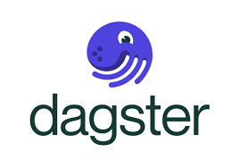
  
</p>


☁️ Lưu trữ & Truy xuất dữ liệu
<p>  

 
  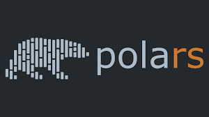
<p> 

📊 Visualization
<p>
 
</p>
---

## Giao diện Streamlit

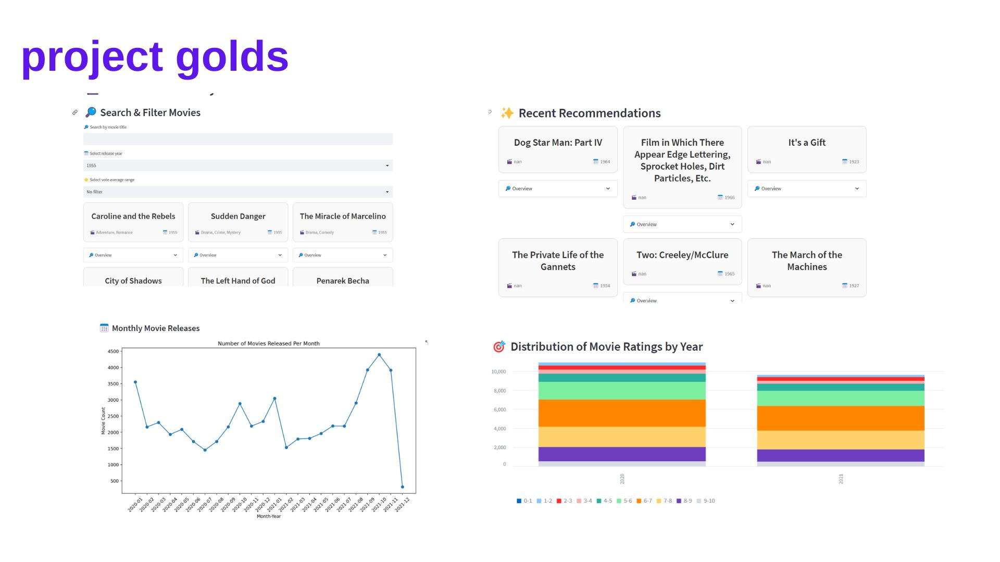  

## Project Overview


## 1. Data pipeline design 

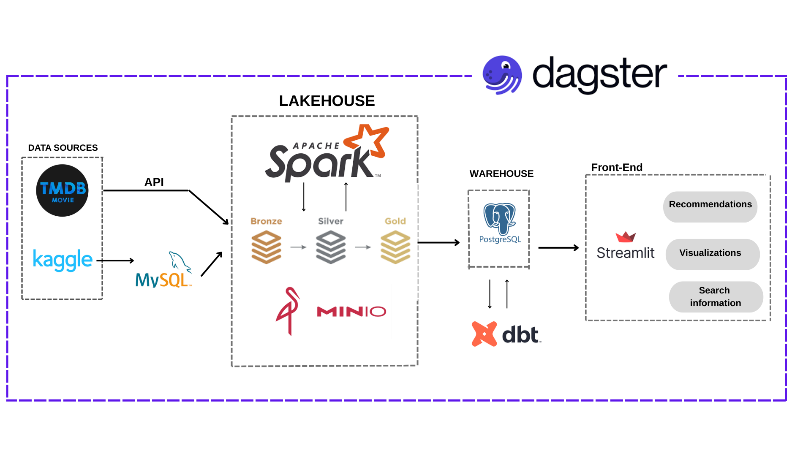  

**1. Data Sources – Thu thập dữ liệu**

  - Dữ liệu phim được lấy từ 2 nguồn chính:

    - `TMDB API`: Trích xuất thông tin phim từ API chính thức của The Movie Database (TMDB), bao gồm các bộ phim yêu thích của cá nhân.

    - `Kaggle`: Dataset(~1M) về thông tin phim của TMDB

  - `MySQL`: Dữ liệu thô, chưa qua xử lý ban đầu(dataset kaggle 1M) được đẩy vào MySQL

**2. Lakehouse – Xử lý và tổ chức dữ liệu**
  - Dữ liệu thô được đưa vào hệ thống xử lý trung tâm sử dụng:

      - `Apache Spark`: Dùng để xử lý dữ liệu lớn với tốc độ cao, theo kiến trúc đa tầng:

          - `Bronze`: Lưu trữ dữ liệu thô ban đầu sau khi ingest

          - `Silver`: Làm sạch và chuẩn hóa dữ liệu

          - `Gold`: Enrich và tổ chức dữ liệu phục vụ phân tích và mô hình

      - `Polars` Sử dụng trong một số tác vụ tiền xử lý/làm sạch dữ liệu hiệu năng cao

      - `Spark MLlib`: Áp dụng các kỹ thuật machine learning đơn giản hoặc gợi ý dựa trên nội dung

**3. Warehouse – Lưu trữ dữ liệu**
  - Sau khi xử lý qua các tầng Bronze → Silver → Gold, dữ liệu được nạp vào PostgreSQL như một Data Warehouse.

    Đây là nơi lưu trữ dữ liệu đã sẵn sàng cho phân tích, truy vấn và phục vụ các ứng dụng phía người dùng.

    `DBT` :  xây dựng các bảng trung gian (models)  tiện cho truy vấn của Front-end

**4. Streamlit – Giao diện người dùng**
  - Sử dụng `Streamlit` để xây dựng giao diện trực quan, bao gồm 3 tính năng chính:

    - `Recommendations`: Hệ thống gợi ý phim dựa trên hành vi hoặc nội dung

    - `Visualizations`: Biểu đồ, dashboard về dữ liệu phim

    - `Search Information`: Tìm kiếm phim theo bộ lọc(rating, genres, time)


        ---

## 2. Data lineage

 Tôi sử dụng **Dagster** để orchestrator. Dagster là một data orchestrator giúp xây dựng, quản lý và giám sát các pipeline xử lý dữ liệu


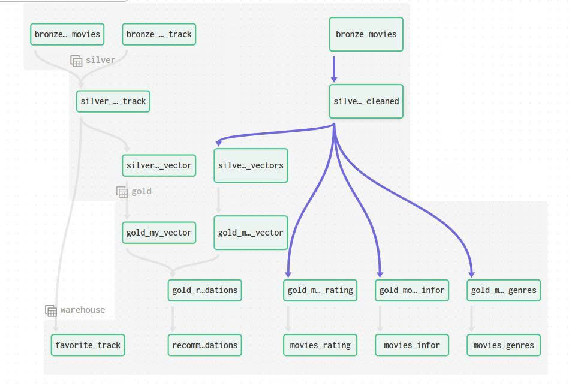  

**chia tiết từng layer**


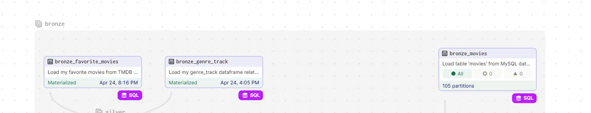  

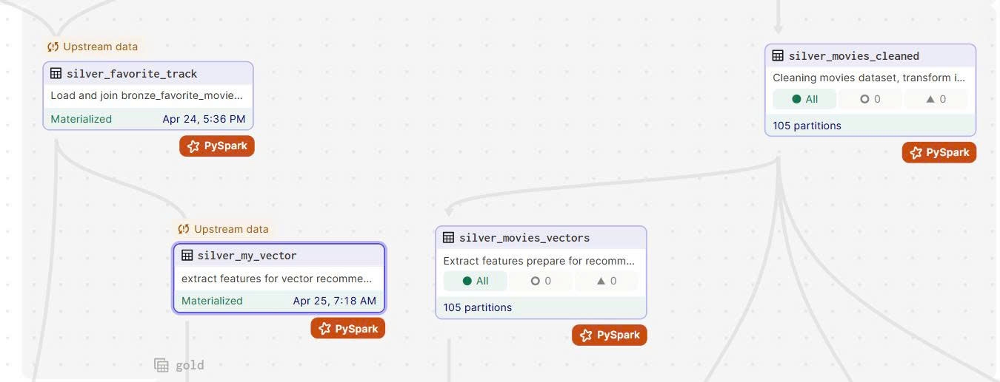  

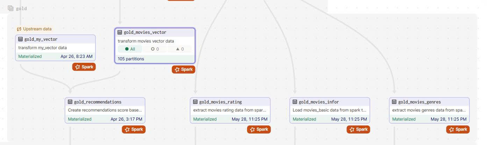  

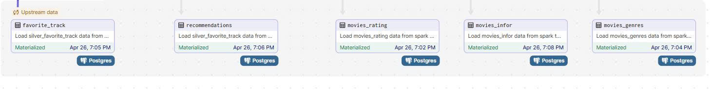  

## 3..Các Bước Cài Đặt & Triển Khai

### Yêu Cầu Ban Đầu
- Docker<Docker Compose>
- DBvear hoặc một công cụ quản lý SQL (để quản lý database cho PostgreSQL và MySQL)
- Python 3

### Các Bước Triển Khai

1. **Clone Repository & Cài Đặt Dự Án:**
    ```sh
    git clone <repository-url>
    cd <repository-folder>
    ```
2. **Tải Dataset:**
   - Tải dataset từ Kaggle ([Link tải dataset](https://www.kaggle.com/datasets/asaniczka/tmdb-movies-dataset-2023-930k-movies)) và đặt chúng vào thư mục `dataset`.

3. **Chuẩn Bị File ENV:**

   - Điền các thông tin cần thiết vào file [env](http://_vscodecontentref_/0):
     - **TMDB:** Truy cập [TMDB](https://www.themoviedb.org/)
      Sau khi tạo tài khoản, bạn hãy tự đánh giá 1 số phim và thêm chúng vào danh mục phim yêu thích.

      Sau đó bạn vào Settings/API --> tại đây bạn sẽ lấy ``API Access Token`` và điền vào env

      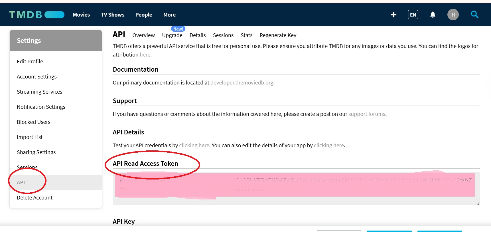  
     
   *(Bạn có thể tùy chỉnh env đối với các nội dung còn lại )*

4. **Thiết Lập Môi Trường Ảo & Kiểm Tra Python:**
    ```sh
    python3 -V        # Kiểm tra phiên bản Python
    python3 -m venv venv  # Tạo môi trường ảo
    source venv/bin/activate
    ```

5. **Biên Dịch & Xây Dựng Các Container Theo Thứ Tự:**
   - Xây dựng các thành phần riêng lẻ (đọc chi tiết trong Makefile):
     ```sh
     make build-dagster
     make build-spark
     make build-pipeline
     make build-streamlit

     make build
     ```
   - Khởi chạy các container:
     ```sh
     make up
     ```
   - Sau khi chạy, vào Docker Desktop để kiểm tra tiến trình container.  

---

## Load Dataset Vào MySQL & PostgreSQL

### Load Dataset vào MySQL

1. **Vào Container MySQL với Quyền Root:**
    ```sh
    make to_mysql_root
    ```
2. **Thực Hiện Các Lệnh Cấu Hình:**
    ```sql
    SET GLOBAL local_infile=TRUE;
    SHOW VARIABLES LIKE "local_infile";
    exit
    ```
3. **Import Dữ Liệu:**
    ```sh
    make to_mysql
    source /tmp/mysql_schemas.sql;
    show tables;
    source /tmp/load_dataset/mysql_load.sql;
    exit
    ```
4. **Kiểm Tra Dữ Liệu Trên DBveaver:**  
   Kết nối và kiểm tra dữ liệu đã được upload lên MySQL.

### Tạo Database cho PostgreSQL

1. **Vào Container PostgreSQL:**
    ```sh
    make to_psql
    ```
2. **Thực Hiện Lệnh Tạo Database:**
    ```sql
    source /tmp/load_dataset/psql_datasource.sql;
    ```
3. **Kiểm Tra Dữ Liệu:**  
   Tương tự như MySQL, bạn cũng sử dụng DBeaver để kết nối PSQL và kiểm tra database

---

4. Tiếp Theo: Tự Động Hóa Job & Chạy Các Asset Qua Dagster

- Sau khi hoàn thành việc cài đặt và import dữ liệu, hãy vào giao diện của Dagster theo địa chỉ đã cấu hình (vd: `http://localhost:3001`) để kiểm tra và chạy các asset ELT.
- Từ giao diện Dagster, bạn có thể theo dõi pipeline ELT, chạy thử từng asset, và xem log để đảm bảo quá trình ELT hoạt động bình thường.

5. Xây dựng các model truy cấn bằng DBT 
- Sau khi chạy asset tới warehouse, bạn tiếp tục chạy thủ công DBT bằng lệnh(chạy lần lượt)
    ```sh
        cd elt_pipeline/dbt_movies
        dbt debug
        dbt build
    ```
6. Truy cập Streamlit để khám phá application
      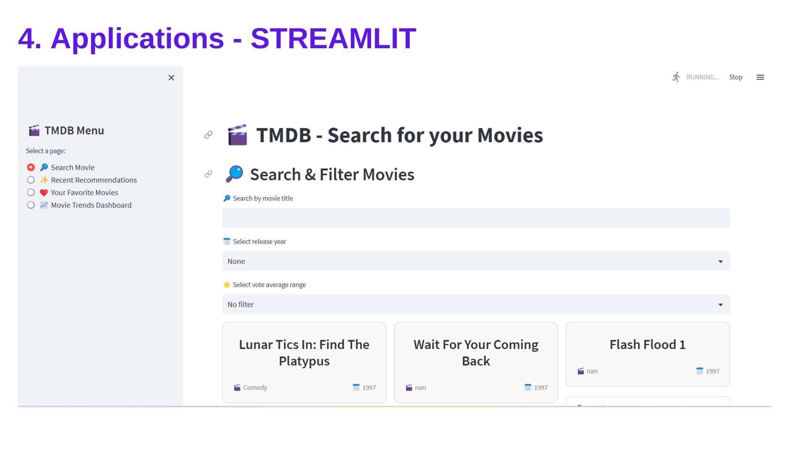  
---

## Lời Kết

Đây là dự án Data Pipeline thứ hai mà mình thực hiện, qua đó mình đã có cơ hội học thêm và áp dụng các công nghệ mới trong lĩnh vực Data Engineering.
Mình hy vọng rằng source code này sẽ trở thành một tài liệu tham khảo hữu ích cho bạn – dù đang học tập hay làm việc – trên hành trình khám phá và phát triển trong lĩnh vực dữ liệu.

**Happy Coding!**