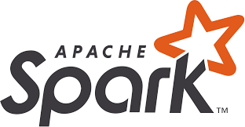

# ELT Pipeline for TMDB-Pipeline-Recommendation

TMDB-Pipeline-Recommendation is a Data Engineering project that builds a complete ELT pipeline to support:

- A movie recommendation system based on personal rating history
- Analytical dashboards for movie information

The project focuses on designing a full-fledged ELT pipeline, starting from data collection (Kaggle, TMDB API), transformation using Apache Spark following Lakehouse architecture, storage in PostgreSQL, data modeling with DBT, and visualization with Streamlit. Dagster is used as the data orchestrator.

---

## 📚 Table of Contents

## 📚 Table of Contents

1. [Main Technologies & Tools Used](#main-technologies--tools-used)  
2. [Streamlit Interface](#streamlit-interface)  
3. [Project Overview](#project-overview)  
   - [Data Pipeline Design](#data-pipeline-design)  
   - [Data Lineage](#data-lineage)  
4. [Installation & Deployment Steps](#installation--deployment-steps)  
5. [Load Dataset into MySQL & PostgreSQL](#load-dataset-into-mysql--postgresql)  
6. [Automate Jobs & Run Assets with Dagster](#automate-jobs--run-assets-with-dagster)  
7. [Build Query Models Using DBT](#build-query-models-using-dbt)  
8. [Explore the Application with Streamlit](#explore-the-application-with-streamlit)  
9. [Conclusion](#conclusion)

---

## 🚀 Main Technologies & Tools Used


<p>
  
  
  
  
</p>

<p>
  
  
  
  
   
</p>


---

## Streamlit Interface


---

## 3. Project Overview

### 3.1. Data Pipeline Design


**1. Data Sources – Collecting Data**

- Movie data is collected from two main sources:

  - `TMDB API`: Retrieves movie info from TMDB’s official API, including user-rated favorite movies.
  - `Kaggle`: Dataset (~1M) containing TMDB movie information.

- `MySQL`: Raw, unprocessed Kaggle dataset (~1M rows) is first loaded into MySQL.

**2. Lakehouse – Processing & Structuring Data**

- Centralized data processing is handled using:

  - `Apache Spark`: High-speed big data processing, structured into multiple layers:
    - **Bronze**: Stores raw ingested data
    - **Silver**: Cleaned and normalized data
    - **Gold**: Enriched and structured data ready for analytics

  - `Polars`: Used for lightweight, efficient pre-processing tasks.

  - `Spark MLlib`: Used for simple ML techniques or content-based recommendation.

**3. Data Warehouse – PostgreSQL**

- Once processed, data flows from Bronze → Silver → Gold, then into a PostgreSQL data warehouse.

  - `DBT`: Builds intermediate data models to simplify queries for the frontend.

**4. Streamlit – User Interface**

- Streamlit is used to create the user interface, with three main features:
  - **Recommendations**: Suggest movies based on behavior/content
  - **Visualizations**: Dashboards and charts from movie data
  - **Search Information**: Filter movies by rating, genre, release year

---

### 3.2. Data Lineage

Dagster is used as the **orchestrator**. It allows managing, scheduling, and visualizing data pipelines.


**Detailed Breakdown by Layer**


---


## 4. **Installation & Deployment Steps**


### 3.1. Prerequisites
- Docker & Docker Compose
- DBeaver or any SQL management tool (for PostgreSQL and MySQL)
- Python 3

### 3.2. Setup Steps

1. **Clone the Repository & Set Up the Project:**
   ```sh
   git clone <repository-url>
   cd <repository-folder>
   ```

2. **Download the Dataset:**
   - Download the dataset from Kaggle ([Dataset link](https://www.kaggle.com/datasets/asaniczka/tmdb-movies-dataset-2023-930k-movies)) and place the files into the `dataset` directory.

3. **Prepare the ENV File:**
   - Fill in the necessary details in the ENV file. For example, for TMDB, visit [TMDB](https://www.themoviedb.org/) to create an account, add some favorite movies, and then go to Settings/API to obtain your **API Access Token**. Add this token in your ENV file.
   - *(Feel free to customize the ENV file for additional configurations as needed.)*
   - 

4. **Set Up the Virtual Environment & Verify Python Installation:**
   ```sh
   python3 -V        # Check your Python version
   python3 -m venv venv  # Create a virtual environment
   source venv/bin/activate
   ```

5. **Build & Start the Containers:**
   - Build each component sequentially as specified in the Makefile:
     ```sh
     make build-dagster
     make build-spark
     make build-pipeline
     make build-streamlit
     
     make build
     ```
   - Start the containers:
     ```sh
     make up
     ```
   - Once running, use Docker Desktop to monitor container progress.

---

## Load Dataset into MySQL & PostgreSQL

### Loading Dataset into MySQL

1. **Access the MySQL Container as Root:**
   ```sh
   make to_mysql_root
   ```
2. **Set Up MySQL Configuration:**
   ```sql
   SET GLOBAL local_infile=TRUE;
   SHOW VARIABLES LIKE "local_infile";
   exit
   ```
3. **Import the Dataset:**
   ```sh
   make to_mysql
   source /tmp/mysql_schemas.sql;
   show tables;
   source /tmp/load_dataset/mysql_load.sql;
   exit
   ```
4. **Verify the Data:**  
   Connect using DBeaver (or another SQL tool) to check that the data has been successfully uploaded to MySQL.

### Creating the Database for PostgreSQL

1. **Access the PostgreSQL Container:**
   ```sh
   make to_psql
   ```
2. **Execute the Database Creation Script:**
   ```sql
   source /tmp/load_dataset/psql_datasource.sql;
   ```
3. **Verify the Imported Data:**  
   Use DBeaver (or another SQL tool) to connect to PostgreSQL and verify the database schema and data.

---

## 5. Automate Jobs & Run Assets with Dagster

- Once the installation and data import are complete, open the Dagster UI (e.g., `http://localhost:3001`) to monitor and run the ELT assets.
- Use the Dagster interface to track the pipeline’s progress, execute individual assets, and review logs to ensure everything is running smoothly.

---

## 6. Build Query Models Using DBT

- After loading data into the warehouse, navigate to the dbt project folder and build your models sequentially:
   ```sh
   cd elt_pipeline/dbt_movies
   dbt debug
   dbt build
   ```

---

## 7. Explore the Application with Streamlit

- Access the Streamlit interface to view dashboards, movie recommendations, and visualizations.
  

---

## Conclusion

This is my second Data Pipeline project, through which we’ve had the opportunity to learn and implement new technologies within the Data Engineering field. We hope that this source code serves as a valuable reference for developers and learners exploring data-driven solutions.

**Happy Coding!**
